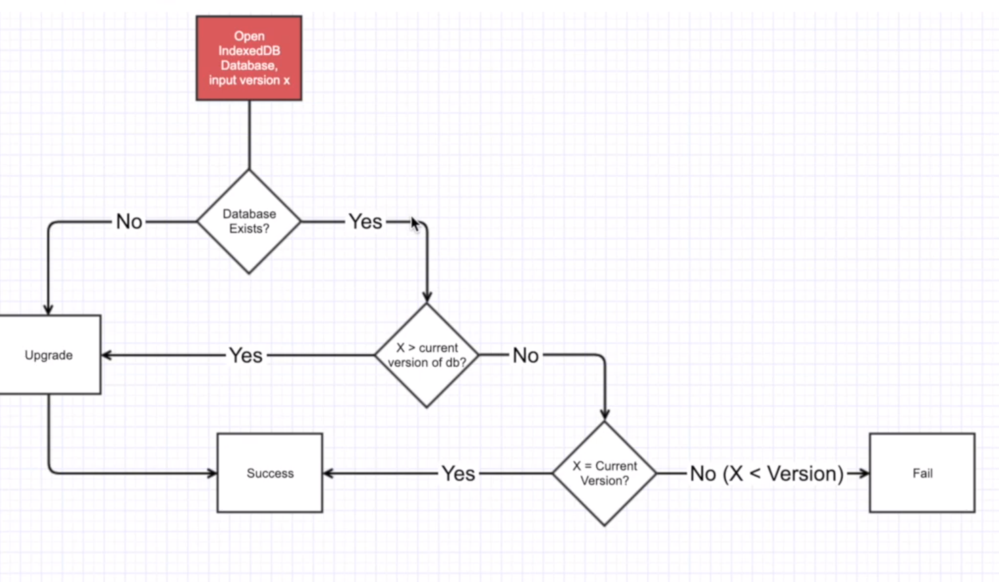

# IndexedDB

### Flow of indexedDB



Specify database schema , open a connection with your database and then retrieve and update data within a series of transactions.

## Open a database

`const request = indexedDB.open(dbName,dbVersion)`

## events

    - onupgradeneeded
    - onerror
    - onsuccess

```js
request.onupgradeneeded = (e) => {}; // on each version create you have to create dataStores again and enter the data again in them
request.error = (e) => {};
request.success = (e) => console.log(`error ! ${e.target.error}`);
```

## Access the Database

- access database in `onupgradeneeded` event or the `success` event using
  `event.target.result`

ex-

```js
request.success = (event) => console.log("db", event.target.result);
//or
request.onupgradeneeded = (e) => console.log("db", e.target.result);
//or
request.success = (event) => console.log("db", request.result); // here event is success , target is request)
```

## add to the database

1. ### Create a Transaction

- create a transaction for the desired objectStoreName with the permissions required `"readwrite"` or `"readonly"`. By default the permission is set to `"readonly"` , so you can skip the second argument (of permissions) if you require only read access

#### Syntax to create a transaction

```js
const tx = db.transaction("<name-of-objectStore>", "<permissions-required>");

// below are a few examples of creating a transaction

const tx = db.transaction("personal_notes", "readwrite");

// or if I only require read access I can write
const tx = db.transaction("personal_notes", "readonly");
// or
const tx = db.transaction("personal_notes"); // you can skip readonly cuz by default all transactions are readonly
```

### catch errors in transaction

- `.onerror` event is used to catch errors while a transaction is processing

#### syntax to write a onerror

```js
tx.onerror = (e) => {
  alert(`Error occurred -> ${e.target.error}`);
  // can also use `tx.error` in place of `e.target.error` since they mean the same thing
};
```

2. ### Get the ObjectStore and add data into it

####syntax to get the objectStore from the transaction and add data in it
example-

```js
// define data or fetch it , here we will define it
 data = {
    title:`note1 ${Math.random()}`,
    text:`this our Note friend`
 }

// access the objectStore from the transaction
const pNotes = tx.objectStore("personal_notes);
// add data to the objectStore
pNotes.add(data)
```

## View Database

1. Create a transaction with the desired objectStore and readonly access
2. get the object store from the transaction
3. make the .openCursor() request.
4. define the onsuccess event of the request to - if the cursor has any value then display it and then move on to the next cursor with -> cursor.continue() , and if there is no value in cursor then do nothing
5. access the cursor values object with - `cursor.value`

following is an example to view database

```js
function viewNotes() {
  const tx = db.transaction("personal_notes"); // this by default gives the transaction readonly access
  const pNotes = tx.objectStore("personal_notes");

  request = pNotes.openCursor(); //makes a request to open cursor

  request.onsuccess = (e) => {
    const cursor = e.target.result // cursor is the result of the request made to openCursor from objectStore - pNotes

    if(cursor){
      alert(note primaryKey: ${cursor.primaryKey} , title: ${cursor.value.title}, text: ${cursor.value.text})

      cursor.continue() // recalls the openCursor() request to provide the next cursor or the next object of the specified objectStore

    } // if the cursor is empty it does nothing and stops the loop
  };
}
```

# Full Methods

#### source MDN

## 1. Connecting to a database

1. IDBFactory

   - IDBFactory.open()
   - IDBFactory.deleteDatabase()
   - IDBFactory.cmp() _compares two keys and returns result indicting the greater one_ - _used in Web Workers_

## 2. Retrieving and Modifying Data
